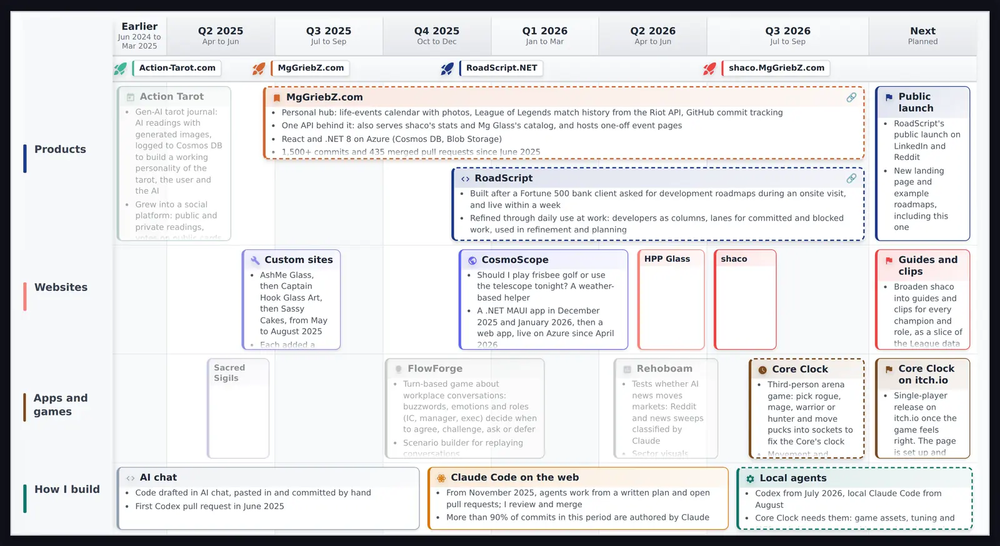

# RoadScript

  



RoadScript is a free roadmap tool for product owners and the stakeholders they keep informed. Build a roadmap by clicking, or write it as JSON. It runs in your browser with no account and no backend, and your roadmaps are saved in that browser.

**Live at [roadscript.net](https://roadscript.net)**

## Examples

Read-only examples you can open, read item by item, or copy into your own roadmaps:

- [Portfolio overview](https://roadscript.net/showcase/portfolio): my products and projects from 2024 to 2026
- [RoadScript build history](https://roadscript.net/showcase/roadscript): this repo's own history, from its git log
- [MgGriebZ.com build history](https://roadscript.net/showcase/mggriebz)
- [shaco build history](https://roadscript.net/showcase/shaco)

Each example has a timeline, a list view for reading on a phone, and the JSON behind it.

## Why it exists

A Fortune 500 bank client asked for roadmaps of our development work during an onsite visit. The first version of RoadScript was live within a week, and it has been refined through daily use at work since: developers as columns, lanes for committed and blocked work, and a board to talk through in refinement and sprint planning.

It is built with AI coding agents. I write the plan, the agents implement it in pull requests, and I review and merge every change.

## Features

**Two ways to edit one roadmap**
- Visual editor: click any lane, column, item or milestone to edit it in the properties panel. Drag items to move them and drag their edges to resize them.
- JSON editor: the same roadmap as plain JSON, for bulk edits or keeping a roadmap in version control. A change in one view shows up in the other.

**Roadmap building blocks**
- Columns for any time scale: quarters, months, sprints, days or hours. Leave a column's label empty and the column before it widens to cover both, for periods of different lengths.
- Swim lanes with adjustable heights and optional progress bars
- Items with icons, colors, markdown descriptions, and states for ongoing (dashed), paused (grey) and hidden work. Overlapping items stack into rows.
- Milestones in the header or inside a lane
- Links from a title, lane or item to another roadmap

**Organizing and sharing**
- Up to 3 folders with 5 roadmaps each
- Share links that carry the whole roadmap in the URL, so sharing needs no server
- Export as JSON, Markdown or SVG
- Starter templates: daily planning, projects, milestones, retro and flows
- Installable as an app

**Keyboard shortcuts in the editor**
- `Esc` clears the selection
- `Ctrl`/`Cmd` + `D` duplicates the selected element, `Delete` removes it
- Arrow keys move between elements
- `Ctrl`/`Cmd` + `P` toggles preview mode

## Data and privacy

- Roadmaps are saved in your browser's localStorage. Nothing is sent to a server.
- If saved data ever can't be read, RoadScript keeps a backup copy instead of overwriting it.
- Export your roadmaps as JSON to back them up or move them to another browser.

## JSON format

<details>
<summary>Example roadmap</summary>

```json
{
  "title": "2026 product roadmap",
  "subtitle": "Platform modernization",
  "columns": [
    { "label": "Q1 2026", "sub": "Jan to Mar" },
    { "label": "Q2 2026", "sub": "Apr to Jun" }
  ],
  "milestones": [
    { "start": 25, "title": "Beta launch", "icon": "flag", "color": "#45B69C" }
  ],
  "lanes": [
    {
      "title": "Team Alpha",
      "color": "#45B69C",
      "height": 1.0,
      "items": [
        {
          "title": "Core platform upgrade",
          "start": 0,
          "length": 1.5,
          "spanning": true,
          "icon": "rocket",
          "color": "#667eea",
          "description": "- Database migration\n- API modernization"
        }
      ]
    }
  ]
}
```

</details>

| Property | Type | Description |
|----------|------|-------------|
| `title`, `subtitle` | string | Roadmap heading |
| `linkedRoadmapId` | string | Optional link from the title to another roadmap |
| `columns[].label`, `columns[].sub` | string | Column label and sub-label. A column with no label, sub-label or icon widens the column before it. |
| `columns[].icon`, `columns[].color` | string | Optional column icon and color |
| `milestones[].start` | number | Position across the timeline, 0 to 100 |
| `milestones[].title`, `icon`, `color` | string | Milestone label and marker |
| `milestones[].laneIndex` | number | Optional lane to place the milestone in; omit for the header |
| `milestones[].verticalPercent` | number | Optional height within the lane, 0 to 100 |
| `lanes[].title` | string | Lane name (`&` starts a new line) |
| `lanes[].color`, `lanes[].icon` | string | Lane accent color and optional icon |
| `lanes[].height` | number | Relative height, 1.0 by default |
| `lanes[].history` | object | Optional progress bar: `start`, `end`, `percent` (0 to 100) and `origin` (`left`, `middle` or `right`) |
| `lanes[].linkedRoadmapId` | string | Optional link to another roadmap |
| `items[].title` | string | Item name |
| `items[].start`, `items[].length` | number | Position and width in columns; decimals are allowed |
| `items[].description` | string | Markdown: bullets, sub-bullets, bold, italic, code and links |
| `items[].spanning` | boolean | Dashed border for ongoing work |
| `items[].greyed` | boolean | Grey for paused or retired work |
| `items[].hidden` | boolean | Hidden in preview mode and exports |
| `items[].icon`, `items[].color` | string | Status icon and color |
| `items[].linkedRoadmapId` | string | Optional link to another roadmap |

Older roadmaps that use `items[].details` (bullet objects) still load and are converted to `description`.

## Building from source

Prerequisites: the [.NET 9 SDK](https://dotnet.microsoft.com/download/dotnet/9.0)

```bash
git clone https://github.com/MgGriebZ/RoadScript.git
cd RoadScript
dotnet watch run
```

Run the tests:

```bash
dotnet test tests/RoadScript.Tests/RoadScript.Tests.csproj
```

The example roadmaps live in `wwwroot/showcase/`. See [tools/showcase-data](tools/showcase-data/README.md) for how they are generated from dated facts.

## License

MIT. See [LICENSE](LICENSE).

## Acknowledgments

Inspired by [Mermaid.live](https://mermaid.live).
